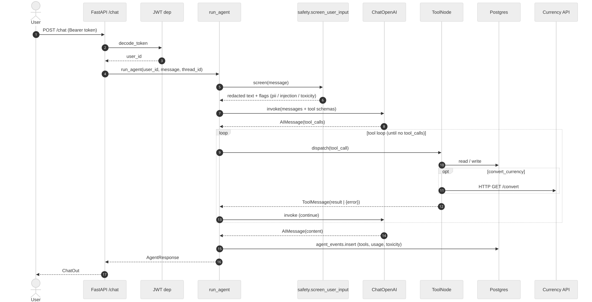

# Архитектура

Визуальный обзор FinPaws. Диаграммы написаны на Mermaid (исходники — в [`diagrams/`](diagrams/),
GitHub рендерит их прямо в Markdown) и предварительно собраны в SVG, чтобы они открывались в любом
просмотрщике.

Сопутствующие документы: [`system-design.md`](system-design.md) — архитектурные решения и failure
modes; per-module спецификации — в [`specs/`](specs/); риски и политика логов —
в [`governance.md`](governance.md); продуктовое обоснование — в
[`product-proposal.md`](product-proposal.md); метрики качества — в [`benchmarks.md`](benchmarks.md).

## Слои (TL;DR)

- `app/api` — FastAPI: auth, CRUD, `/chat`, `/preferences`, `/agent/events`, `/metrics`.
- `app/agent` — LangGraph-оркестратор, инструменты (LangChain `StructuredTool`), KB
  (Chroma/Qdrant), safety pre-step (PII · injection · toxicity), prompts, чекпоинтер,
  Langfuse-трейсинг.
- `app/auth` — JWT + bcrypt.
- `app/integrations` — курсы валют (exchangerate.host), hledger CLI.
- `app/observability` — loguru + Prometheus-счётчики.
- `app/evals` — golden-сценарии, лёгкий runner, deepeval-runner + LLM-судья.
- `app/domain`, `app/services`, `app/main.py` — stdlib-only бюджетный CLI `finpaws` и общая
  математика планирования/отчётов.

## C4 · System context

[Источник](diagrams/c4-context.md)

## C4 · Containers

[Источник](diagrams/c4-container.md)

## C4 · Components (ядро агента)

[Источник](diagrams/c4-component.md) — внутреннее устройство `app/agent/*`: orchestrator,
safety pre-step, tools, KB, memory, checkpointer, tracing.

## Data flow — один ход диалога

[Источник](diagrams/data-flow.md) — включает примечания по хранению и приватности.

## Workflow — `POST /chat`

[Источник](diagrams/workflow.md)

---

Чтобы перерисовать SVG после правки исходника `.md` — `make diagrams`.
