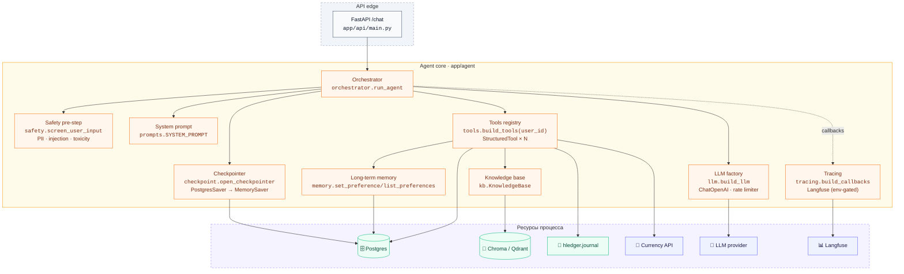

# C4 · Components (ядро агента)

Внутреннее устройство `app/agent/*` — модули в одном Python-процессе, разворачиваемые
вызовом `run_agent(...)` из `app/api/main.py::/chat`.

## Ответственности компонентов

| Компонент | Файл | Ответственность | Stop / fallback |
|---|---|---|---|
| Orchestrator | `agent/orchestrator.py` | сборка ReAct-графа, цикл LLM↔tools, запись `agent_events`, top-level try/except | recursion limit → лог, дружелюбный ответ |
| Safety pre-step | `agent/safety.py` | PII regex-redaction, injection-маркеры, rule-based toxicity | при срабатывании — флаги в ответе, текст всё равно идёт в LLM в отредактированном виде |
| System prompt | `agent/prompts.py` | роль, дисклеймер, обязательное использование инструментов | — |
| LLM factory | `agent/llm.py` | `ChatOpenAI` поверх любого OpenAI-совместимого endpoint; `LLM_RPS` → `InMemoryRateLimiter` | retries из `ChatOpenAI` |
| Tools registry | `agent/tools.py` | `StructuredTool`-обёртки с Pydantic-схемой; набор зависит от `user_id` | каждый tool возвращает `{error: …}` вместо исключения |
| Knowledge base | `agent/kb.py` | ленивая инициализация retriever (Chroma/Qdrant + эмбеддинги) | при сбое — `KnowledgeBase(None)`, `search_advice` → `[]` |
| Long-term memory | `agent/memory.py` | CRUD пользовательских предпочтений и категорийных правил | DB-ошибка → `{saved: false}` |
| Checkpointer | `agent/checkpoint.py` | контекст-менеджер `PostgresSaver` | при сбое подключения — `MemorySaver` (память диалога теряется при рестарте) |
| Tracing | `agent/tracing.py` | колбэки `langfuse-langchain` при наличии ключей | без ключей — no-op, агент работает без трейсов |

Rendered: [`c4-component.svg`](c4-component.svg)
