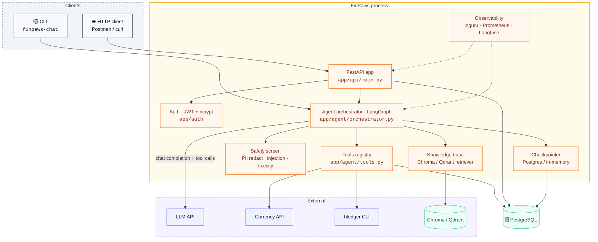

# C4 · Containers

```mermaid
flowchart TB
  subgraph clients["Clients"]
    direction LR
    cli["🐱 CLI<br/><code>finpaws-chat</code>"]
    http["🌐 HTTP client<br/>Postman / curl"]
  end

  subgraph proc["FinPaws process"]
    direction TB
    api["FastAPI app<br/><code>app/api/main.py</code>"]
    auth["Auth · JWT + bcrypt<br/><code>app/auth</code>"]
    orch["Agent orchestrator · LangGraph<br/><code>app/agent/orchestrator.py</code>"]
    tools["Tools registry<br/><code>app/agent/tools.py</code>"]
    safety["Safety screen<br/>PII redact · injection · toxicity"]
    kb["Knowledge base<br/>Chroma / Qdrant retriever"]
    chk["Checkpointer<br/>Postgres / in-memory"]
    obs["Observability<br/>loguru · Prometheus · Langfuse"]
  end

  subgraph ext["External"]
    direction TB
    llm["LLM API"]
    fx["Currency API"]
    hledger["hledger CLI"]
    vec[("Chroma / Qdrant")]
  end

  pg[("🗄 PostgreSQL")]

  cli --> orch
  http --> api
  api --> auth
  api --> orch
  orch --> safety
  orch --> tools
  orch --> kb
  orch --> chk
  orch -- "chat completion + tool calls" --> llm
  tools --> pg
  tools --> fx
  tools --> hledger
  kb --> vec
  api --> pg
  chk --> pg
  obs -.-> orch
  obs -.-> api

  classDef client fill:#f8fafc,stroke:#475569,color:#0f172a;
  classDef core   fill:#fff7ed,stroke:#f97316,color:#7c2d12;
  classDef extn   fill:#eef2ff,stroke:#6366f1,color:#1e1b4b;
  classDef store  fill:#ecfdf5,stroke:#10b981,color:#064e3b;
  class cli,http client;
  class api,auth,orch,tools,safety,kb,chk,obs core;
  class llm,fx,hledger extn;
  class vec,pg store;
  style proc fill:#fffbeb,stroke:#f59e0b,stroke-width:1px;
  style ext  fill:#f5f3ff,stroke:#a78bfa,stroke-dasharray:5 4;
  style clients fill:#f1f5f9,stroke:#94a3b8,stroke-dasharray:5 4;
```

Rendered: [`c4-container.svg`](c4-container.svg)
