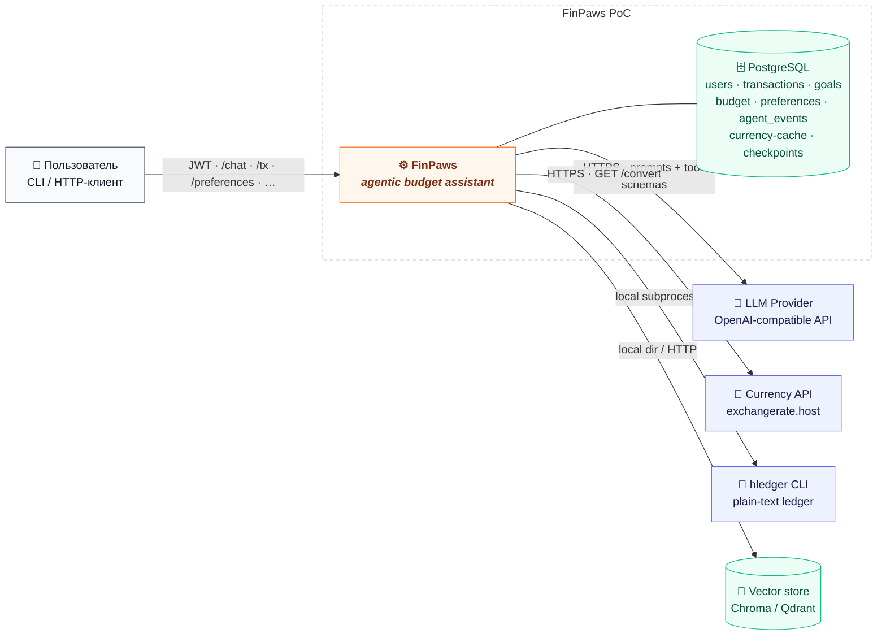

# C4 · System Context

```mermaid
flowchart LR
  user["👤 Пользователь<br/>CLI / HTTP-клиент"]

  subgraph boundary[" FinPaws PoC "]
    direction TB
    app["⚙️ FinPaws<br/><i>agentic budget assistant</i>"]
    db[("🗄 PostgreSQL<br/>users · transactions · goals<br/>budget · preferences · agent_events<br/>currency-cache · checkpoints")]
    app --- db
  end

  llm["🤖 LLM Provider<br/>OpenAI-compatible API"]
  fx["💱 Currency API<br/>exchangerate.host"]
  hledger["📒 hledger CLI<br/>plain-text ledger"]
  vec[("🔎 Vector store<br/>Chroma / Qdrant")]

  user -- "JWT · /chat · /tx · /preferences · …" --> app
  app -- "HTTPS · prompts + tool schemas" --> llm
  app -- "HTTPS · GET /convert" --> fx
  app -- "local subprocess" --> hledger
  app -- "local dir / HTTP" --> vec

  classDef actor fill:#f8fafc,stroke:#475569,color:#0f172a;
  classDef sys   fill:#fff7ed,stroke:#f97316,color:#7c2d12,font-weight:bold;
  classDef ext   fill:#eef2ff,stroke:#6366f1,color:#1e1b4b;
  classDef store fill:#ecfdf5,stroke:#10b981,color:#064e3b;
  class user actor;
  class app sys;
  class llm,fx,hledger ext;
  class db,vec store;
  style boundary fill:none,stroke:#cbd5e1,stroke-width:1px,stroke-dasharray:5 4;
```

Rendered: [`c4-context.svg`](c4-context.svg)
