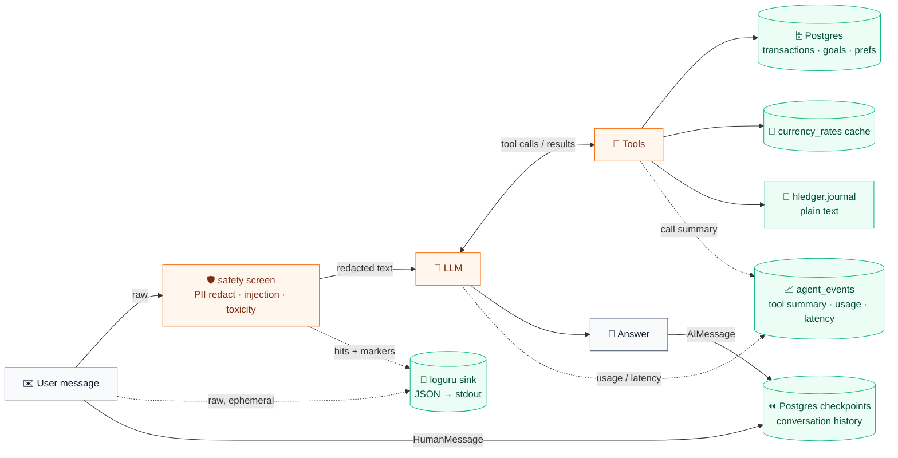

# Data flow · one chat turn

**Storage & privacy**

- **Logs** — redacted text only; raw PII (email / phone / card / IBAN) is masked by regex before anything is logged.
- **Postgres** — financial data is isolated by `user_id` (FK to `users`, `ON DELETE CASCADE`).
- **Checkpoints** — hold conversation history (may include names / transaction details); keyed by `thread_id = "user-{user_id}"` and dropped with the user via cascade.
- **Currency cache** — impersonal.
- **Journal file** — local, plain-text, owned by the user.

Rendered: [`data-flow.svg`](data-flow.svg)
