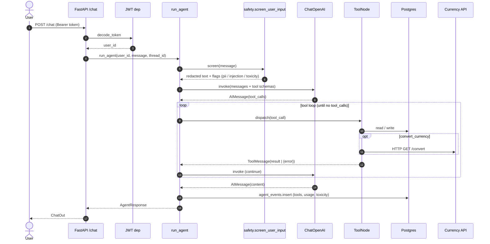
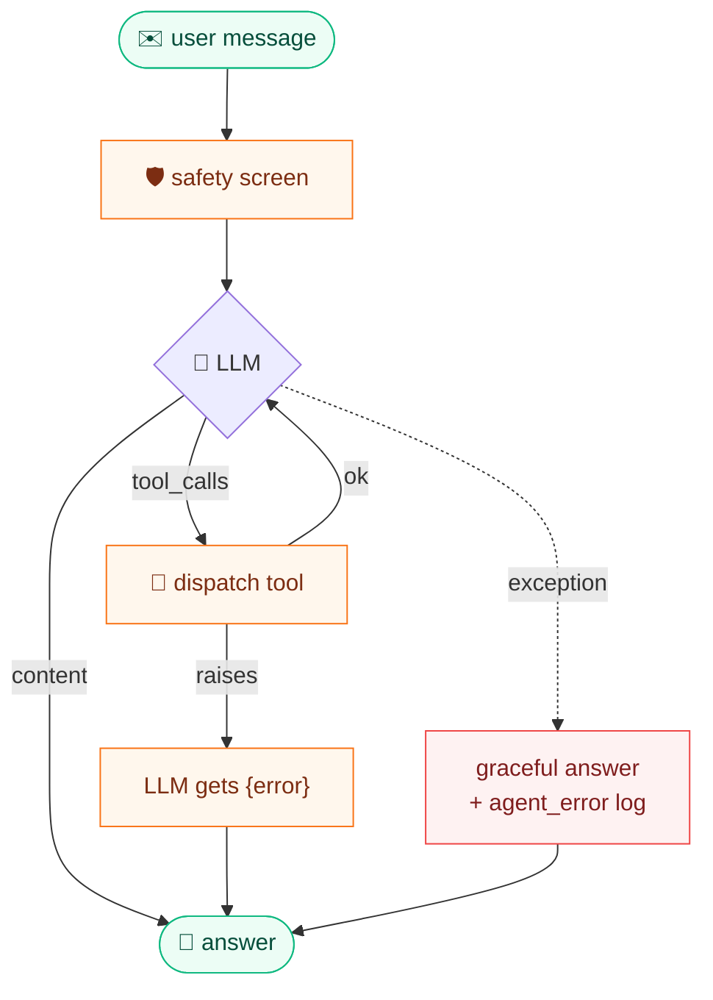

# Workflow · `POST /chat`

## Sequence

```mermaid
sequenceDiagram
  autonumber
  actor U as User
  participant API as FastAPI /chat
  participant Auth as JWT dep
  participant O as run_agent
  participant S as safety.screen_user_input
  participant L as ChatOpenAI
  participant T as ToolNode
  participant DB as Postgres
  participant FX as Currency API

  U->>API: POST /chat (Bearer token)
  API->>Auth: decode_token
  Auth-->>API: user_id
  API->>O: run_agent(user_id, message, thread_id)
  O->>S: screen(message)
  S-->>O: redacted text + flags (pii / injection / toxicity)
  O->>L: invoke(messages + tool schemas)
  L-->>O: AIMessage(tool_calls)
  loop tool loop (until no tool_calls)
    O->>T: dispatch(tool_call)
    T->>DB: read / write
    opt convert_currency
      T->>FX: HTTP GET /convert
    end
    T-->>O: ToolMessage(result | {error})
    O->>L: invoke (continue)
  end
  L-->>O: AIMessage(content)
  O->>DB: agent_events.insert (tools, usage, toxicity)
  O-->>API: AgentResponse
  API-->>U: ChatOut
```

## State machine

```mermaid
flowchart TD
  start(["✉️ user message"]) --> safety["🛡 safety screen"]
  safety --> llm{"🤖 LLM"}
  llm -- "tool_calls" --> dispatch["🔧 dispatch tool"]
  llm -- "content" --> done(["💬 answer"])
  dispatch -- "ok" --> llm
  dispatch -- "raises" --> withErr["LLM gets {error}"]
  withErr --> done
  llm -. "exception" .-> fallback["graceful answer<br/>+ agent_error log"]
  fallback --> done

  classDef term fill:#ecfdf5,stroke:#10b981,color:#064e3b;
  classDef step fill:#fff7ed,stroke:#f97316,color:#7c2d12;
  classDef warn fill:#fef2f2,stroke:#ef4444,color:#7f1d1d;
  class start,done term;
  class safety,dispatch,withErr step;
  class fallback warn;
```

Rendered: [`workflow-sequence.svg`](workflow-sequence.svg) · [`workflow-state.svg`](workflow-state.svg)
